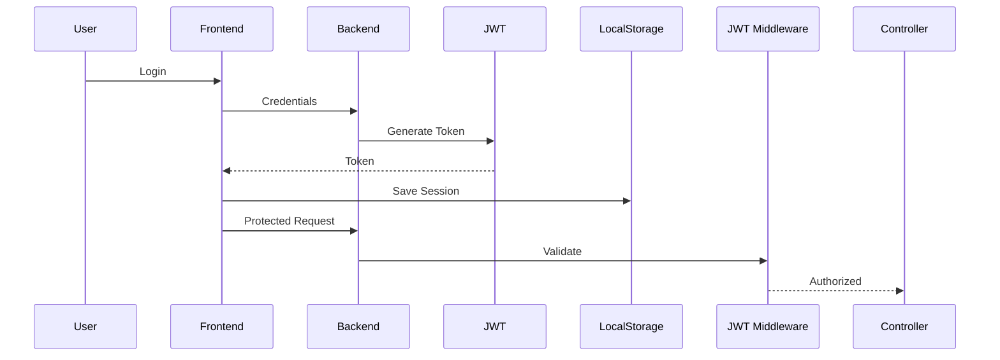

# Buy&Sell

<p align="center">

Full Stack Marketplace Application inspired by platforms such as Wallapop.

Developed as the Final Master's Project (TFM) for the Full Stack Developer Master's Degree at UNIR.

</p>

<p align="center">


</p>

---

# Project Overview

Buy&Sell is a modern marketplace application that allows users to publish, search, manage and purchase second-hand products through an intuitive and responsive interface.

The project was developed collaboratively during the Master's Degree in Full Stack Development at UNIR, following modern software engineering practices and separating the application into an Angular frontend and a Node.js + Express backend connected to a MySQL database.

The application includes secure authentication using JWT, role-based authorization, product management, favourites, reports, reviews and a messaging system prepared for future Socket.IO integration.

---

# Repositories

## Frontend

👉 https://github.com/diegozsr1/buy-sell-front

Angular application.

---

## Backend

👉 https://github.com/diegozsr1/buy-sell-back

Node.js REST API.

---

# Main Features

- User registration and login

- JWT Authentication

- Role Based Authorization

- Product publication

- Product editing

- Product image gallery

- Search products

- Product favourites

- User reviews

- Product reports

- Responsive design

- Admin & Moderator areas

- Messaging interface

- REST API

- Swagger Documentation

---

# Technology Stack

## Frontend

- Angular
- TypeScript
- Signals
- Bootstrap
- RxJS

---

## Backend

- Node.js
- Express
- JWT
- Express Middleware
- Swagger
- REST API

---

## Database

- MySQL

---

## Tools

- Git
- GitHub
- MySQL Workbench
- Visual Studio Code
- Postman

---

# Project Architecture

```mermaid
graph LR

User

↓

Angular Frontend

↓

HTTP Interceptor

↓

REST API

↓

JWT Middleware

↓

Controllers

↓

MySQL Database
```

---

# Authentication Flow



---

# Project Modules

Frontend

- Authentication

- Products

- Users

- Reviews

- Reports

- Messaging

- Admin Panel

Backend

- Authentication

- Users

- Products

- Images

- Reviews

- Reports

- Roles

- Middleware

---

# My Contributions

During the development of this project I participated in both frontend and backend development.

Main contributions include:

## Database Design

- Initial Entity Relationship Diagram.
- MySQL Workbench database design.
- Relationships definition.

---

## Frontend

- Angular Routing Architecture

- Mobile Navigation Bar

- Product View

- Dynamic Image Gallery

- Atomic Components

- Button Component

- Badge Component

- Authentication Guard

- Authorization Guard

- HTTP JWT Interceptor

- Reports Module

- Reviews Module

- Favourite Products

- Messaging Interface

---

## Backend

- JWT Middleware

- Role Middleware

- Product Images Endpoint

- Authentication Integration

---

# Technical Challenges

Some of the most interesting challenges solved during the project were:

- Designing reusable Angular components following Atomic Design principles.

- Implementing Angular Signals and Computed properties.

- Synchronising authentication between frontend and backend.

- Protecting routes using Guards, Interceptors and JWT Middleware.

- Building a scalable routing architecture.

- Coordinating collaborative development through Git.

---

# Folder Structure

```text
BuySell

Frontend

Backend

Database

Documentation
```

---

# Future Improvements

- Docker

- Docker Compose

- Socket.IO real-time chat

- Notifications

- CI/CD with GitHub Actions

- Unit Testing

- End-to-End Testing

- Cloud Deployment

- Email Verification

- Password Recovery

---

# Screenshots

The following screenshots can be found inside:

```

docs/screenshots/

```

Recommended screenshots:

- Home

- Login

- Register

- Product View

- User Profile

- Chat

- Admin Dashboard

- Mobile View

---

# Installation

## Clone Frontend

```bash
git clone https://github.com/diegozsr1/buy-sell-front
```

## Clone Backend

```bash
git clone https://github.com/diegozsr1/buy-sell-back
```

Install dependencies

```bash
npm install
```

Run the application

```bash
npm start
```

---

# Documentation

Additional project documentation is available inside the **docs/** folder.

- Architecture

- Authentication

- Database

- Deployment

- Screenshots

---

# Roadmap

✅ Authentication

✅ Authorization

✅ Product Management

✅ Reviews

✅ Reports

✅ Responsive Design

✅ Favourite Products

✅ REST API

✅ Swagger

⬜ Docker

⬜ CI/CD

⬜ Socket.IO

⬜ Unit Tests

⬜ Deploy

---

# About the Project

This application was developed as a collaborative Final Master's Project (TFM) for the Full Stack Developer Master's Degree at UNIR.

The objective was not only to build a marketplace platform, but also to apply professional software engineering practices including modular architecture, authentication, REST API development, reusable components, collaborative Git workflows and scalable frontend design.

---

# Author

**Diego Zapata**

GitHub:

https://github.com/diegozsr1

LinkedIn:

(Add your LinkedIn URL)

